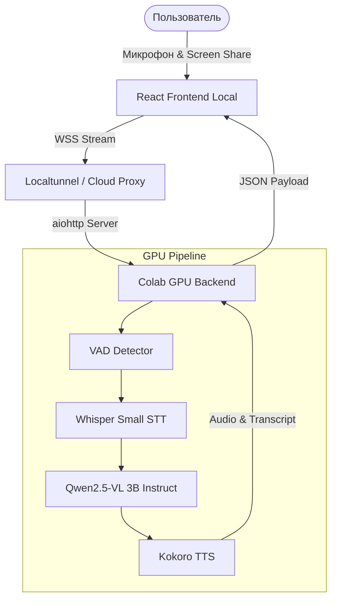

# 🎙️ Realtime Multimodal Assistant (Colab GPU Edition)

Этот проект представляет собой высокопроизводительного мультимодального ИИ-ассистента, способного в реальном времени видеть ваш экран, слышать ваш голос и отвечать естественным синтезированным голосом с минимальной задержкой. Основная логика вынесена в облако (Google Colab T4 GPU) для достижения максимальной скорости инференса.

## 🛠️ Технологический стек

### Frontend (Local)
- **Ядро**: React + Vite, TypeScript.
- **Стили**: Tailwind CSS, Framer Motion (анимации).
- **Компоненты**: Radix UI / Shadcn.
- **Связь**: WebSocket (Base64 streaming для аудио и изображений).

### Backend (Cloud - Google Colab)
- **Сервер**: `aiohttp` (асинхронный Python-сервер для обработки потоков данных).
- **STT (Speech-to-Text)**: OpenAI **Whisper-small** (прямой инференс через тензоры).
- **Vision + Brain**: **Qwen2.5-VL-3B-Instruct** (мультимодальная модель, видит и рассуждает).
- **TTS (Text-to-Speech)**: **Kokoro-82M** (высококачественный синтез речи).
- **VAD (Voice Activity Detection)**: Кастомный детектор энергии сигнала для корректной сегментации речи в облаке.
- **Оптимизация**: 4-bit квантование (`bitsandbytes`) для работы тяжелых моделей на NVIDIA T4 (16GB VRAM).

## 📊 Архитектура проекта



## 🌌 Сложность проекта
**Сложность**: ⭐⭐⭐⭐⭐ (5/5 звезд - Senior)
- Интеграция мультимодальных моделей (Vision + Voice) в реальном времени.
- Обработка WebSocket-потоков с обходом ограничений облачных прокси (localtunnel).
- Настройка инференса тяжелых моделей на GPU в среде Jupyter/Colab.
- Синхронизация визуальной доски (Illustration Board) с фокусом ИИ.

## 🚀 Как запустить

1. **Frontend**:
   ```bash
   cd multimodal-client-vite
   npm install
   npm run dev
   ```
2. **Backend**:
   - Откройте `Youtube_demos/Multimodal-local-server/scripts/colab_backend.ipynb` в Google Colab.
   - Выполните все ячейки по порядку (1-3).
   - Скопируйте публичную ссылку и пароль.
3. **Connect**:
   - Вставьте ссылку в `App.tsx` (WebSocketProvider).
   - Введите пароль в браузере по ссылке тоннеля.
   - Наслаждайтесь общением!
